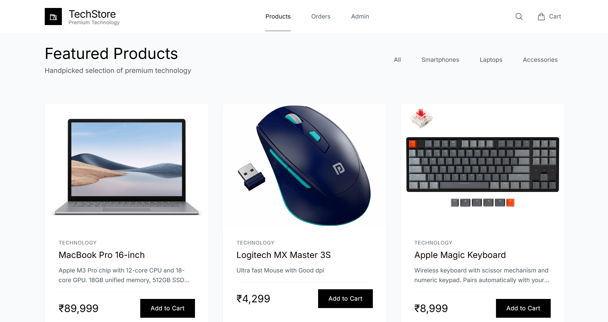
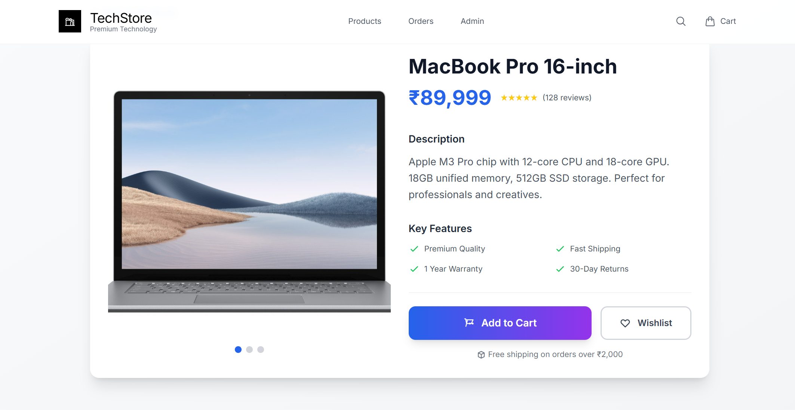
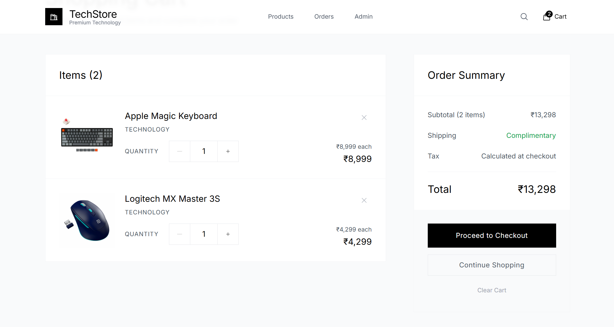
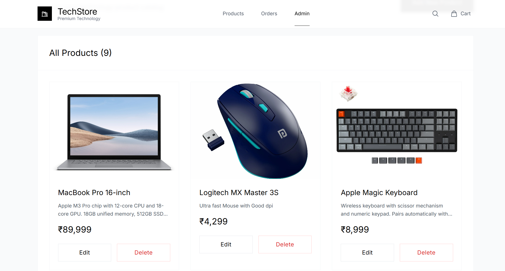
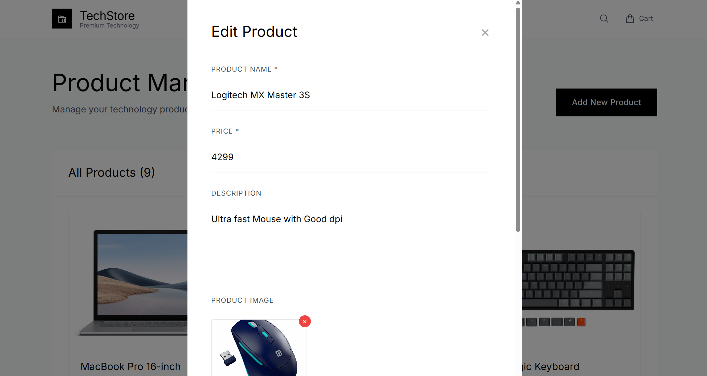
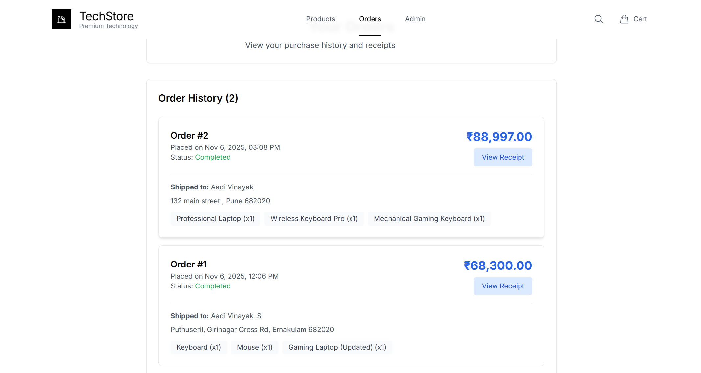

# E-Commerce Shopping Cart Application

A full-stack shopping cart application built for the Vibe Commerce coding assignment. This repository includes the backend API and a React + Vite frontend. The `ecom-assignment/frontend/public/images/screenshots` folder contains annotated screenshots that show key flows — they're embedded below to help reviewers quickly understand the app.

## 🛍️ Features

### Backend APIs
- **GET /api/products** - Fetch 10 mock products with id, name, price, description, and image
- **POST /api/cart** - Add items to cart with productId and quantity
- **GET /api/cart** - Get cart items with total and item count
- **DELETE /api/cart/:id** - Remove specific item from cart
- **PUT /api/cart/:id** - Update cart item quantity
- **POST /api/checkout** - Process checkout and generate mock receipt

### Frontend Features
- **Products Grid** - Responsive product display with "Add to Cart" buttons
- **Cart Management** - View items, update quantities, remove items, and see totals
- **Checkout Flow** - Customer information form with order summary
- **Receipt Modal** - Order confirmation with receipt details and order ID
- **Responsive Design** - Mobile-friendly interface using Tailwind CSS
- **Real-time Updates** - Cart count updates across all components

## 🚀 Tech Stack

### Backend
- **Node.js** with Express.js
- **SQLite** database for persistence
- **CORS** enabled for frontend communication
- REST API architecture

### Frontend
- **React 18.3.1** with hooks and context
- **React Router** for navigation
- **Axios** for API communication
- **Tailwind CSS** for responsive styling
- **Vite** for fast development and building

## 🖼️ Screenshots

Below are screenshots from the app with short captions. The images are included in the repository at `ecom-assignment/frontend/public/images/screenshots/`.

- Product catalog (grid view):

  

  A responsive grid listing the available products with prices and "Add to Cart" actions.

- Product detail page:

  

  The detailed product view with description, image, and quantity selector.

- Cart page (cart management):

  

  Cart view showing items, editable quantities, remove buttons, and order totals.

- Admin page (products list & edit):

  

  Admin dashboard to view products, navigate to edit, and add new products.

- Admin product edit modal/page:

  

  Edit product details and images from the admin UI.

- Order receipt / confirmation:

  

  Receipt modal shown after completing checkout, with order ID and summary.


## 📦 Installation & Setup

### Prerequisites
- Node.js (v16 or higher)
- npm or yarn

### Quick Start

1. **Clone the repository**
   ```bash
   git clone <repository-url>
   cd ecom-assignment
   ```

2. **Install all dependencies**
   ```bash
   npm run install-all
   ```

3. **Start the development servers**
   ```bash
   npm run dev
   ```

This will start:
- Backend server on `http://localhost:3001`
- Frontend development server on `http://localhost:5173`

### Manual Setup

If you prefer to set up manually:

1. **Backend Setup**
   ```bash
   cd backend
   npm install
   npm run dev
   ```

2. **Frontend Setup** (in a new terminal)
   ```bash
   cd frontend
   npm install
   npm run dev
   ```

## 🗄️ Database

The application uses SQLite for data persistence with the following tables:

- **products** - Store product information
- **cart_items** - Manage shopping cart persistence
- **orders** - Store completed order history

The database is automatically created with sample products on first run.

## � API Endpoints

### Products
- `GET /api/products` - Get all products
- `GET /api/products/:id` - Get single product
- `POST /api/products` - Create new product (admin)
- `PUT /api/products/:id` - Update product (admin)
- `DELETE /api/products/:id` - Delete product (admin)

### Cart
- `POST /api/cart` - Add item to cart
  ```json
  {
    "productId": 1,
    "quantity": 2
  }
  ```
- `GET /api/cart` - Get cart contents
- `PUT /api/cart/:id` - Update cart item quantity
- `DELETE /api/cart/:id` - Remove cart item

### Checkout
- `POST /api/checkout` - Process order
  ```json
  {
    "customerInfo": {
      "name": "John Doe",
      "email": "john@example.com",
      "address": "123 Main St",
      "city": "Manila",
      "zip": "1000"
    },
    "cartItems": [...]
  }
  ```

## 🎯 Assignment Requirements Fulfilled

✅ **Backend APIs**: All required endpoints implemented  
✅ **Frontend Components**: Products grid, cart view, checkout form  
✅ **Database Integration**: SQLite with persistent cart and orders  
✅ **Cart Operations**: Add, remove, update quantities, view totals  
✅ **Checkout Flow**: Customer form with order confirmation  
✅ **Receipt Modal**: Order details with timestamp and order ID  
✅ **Responsive Design**: Mobile-friendly interface  
✅ **Error Handling**: Graceful error handling throughout  


## 🧪 Testing the Application

1. **Products Page** - View products and add to cart
2. **Cart Page** - Modify quantities, remove items, see totals
3. **Checkout** - Fill form and complete mock purchase
4. **Receipt** - View order confirmation with details

## 📁 Project Structure

```
ecommerce-app-react-nodejs/
├── backend/
│   ├── index.js          # Express server and API routes
│   ├── database.js       # SQLite database setup
│   └── package.json      # Backend dependencies
├── frontend/
│   ├── src/
│   │   ├── components/   # Reusable React components
│   │   ├── pages/        # Main page components
│   │   ├── context/      # Cart context for state management
│   │   └── App.jsx       # Main application component
│   └── package.json      # Frontend dependencies
└── README.md
```

## 🔄 Development Scripts

- `npm run dev` - Start both frontend and backend in development mode
- `npm run start` - Start production backend with development frontend
- `npm run build` - Build frontend for production
- `npm run install-all` - Install dependencies for all packages

## 🌟 Bonus Features Implemented

- **Database Persistence** - Cart and orders stored in SQLite
- **Error Handling** - Comprehensive error handling and user feedback
- **Loading States** - Loading indicators for better UX
- **Real-time Updates** - Cart automatically refreshes across components
- **Order History** - Orders stored with complete customer and item details
- **Quantity Management** - Update cart item quantities without page refresh


